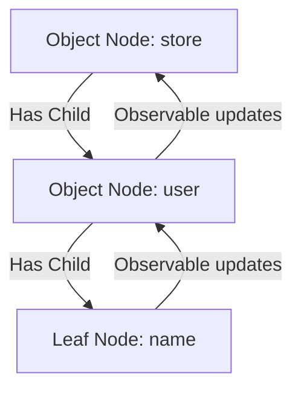
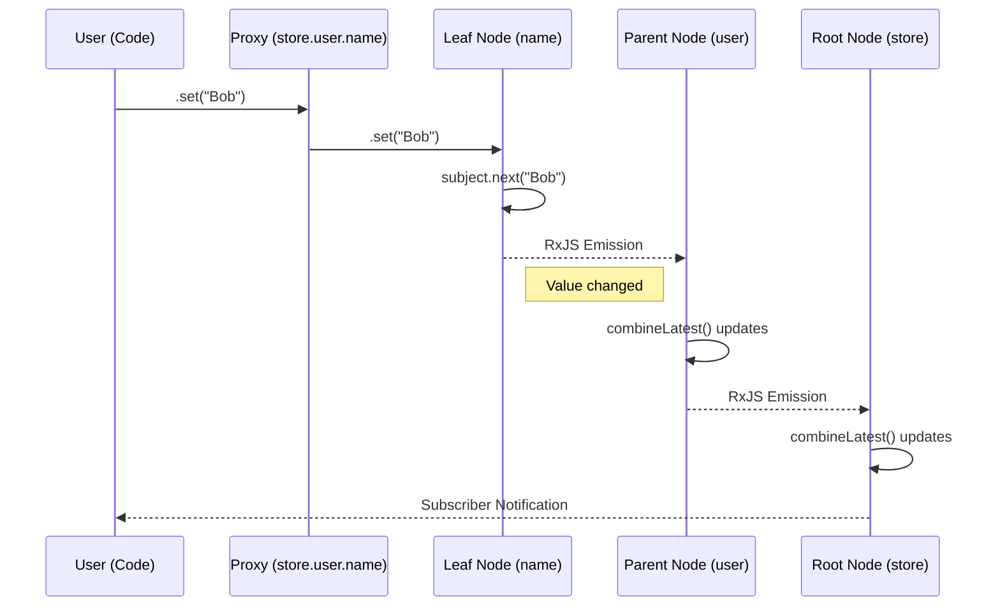
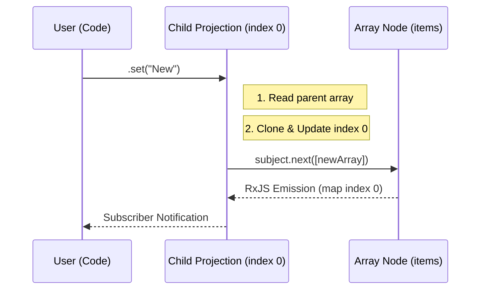
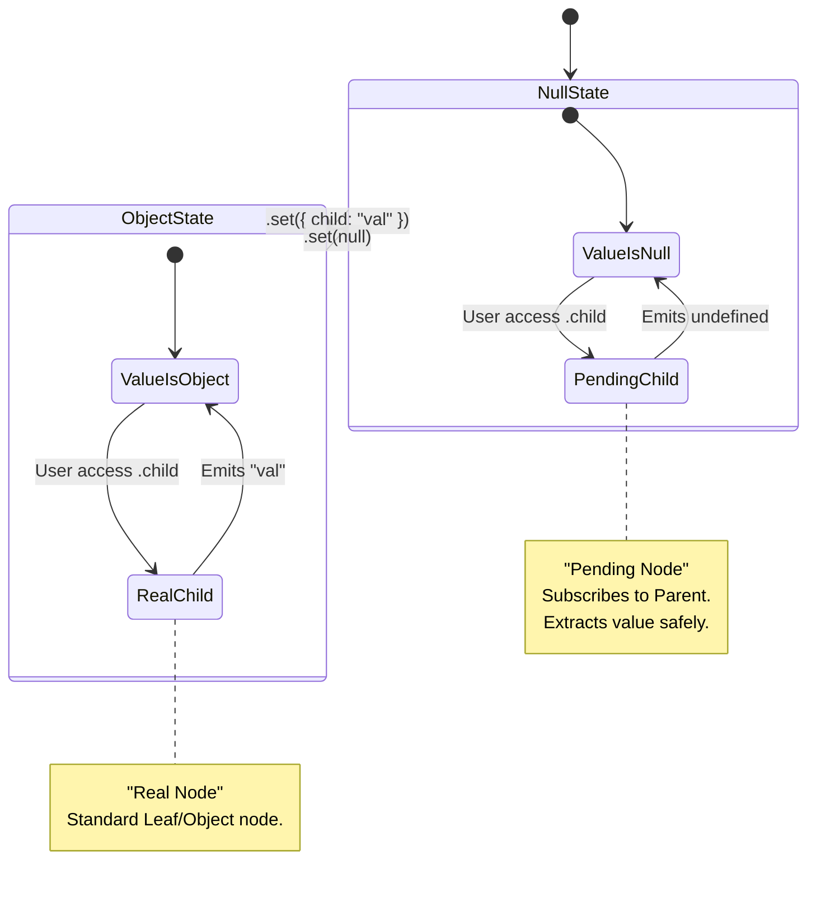

# Internal Architecture of deepstate

This document describes the internal implementation details of the `deepstate` library. It is intended for contributors who want to understand how the library works under the hood.

## Core Design Philosophy

`deepstate` creates a mirror tree structure where every property in your state object corresponds to a "Node" in an internal graph.

*   **External API**: The user interacts with a `Proxy` object that looks like the state (e.g., `store.user.name`).
*   **Internal Model**: Under the hood, this is a tree of `NodeCore` objects, each managing an RxJS `BehaviorSubject`.

This separation allows us to provide a simple, mutable-like API (`.set()`, `.get()`) while maintaining a purely reactive, observable-based core.

## The Node System

The library is built on a few core node types defined in `packages/core/src/deepstate.ts`.

### 1. `NodeCore<T>` Interface

Every internal node implements this interface:

```typescript
interface NodeCore<T> {
  readonly $: Observable<T>;     // The RxJS stream
  get(): T;                      // Synchronous value getter
  set(value: T): void;           // Value setter
  subscribeOnce?(...): Subscription;
}
```

### 2. Node Types

#### **Leaf Node (Primitives)**
*   **Implementation**: `createLeafNode`
*   **Source of Truth**: Its own `BehaviorSubject<T>`.
*   **Logic**: When `.set(val)` is called, it `.next(val)`s the subject. The stream is distinct (`distinctUntilChanged`).

#### **Object Node**
*   **Implementation**: `createObjectNode`
*   **Source of Truth**: **Its children**.
*   **Logic**: The object node itself does *not* store the master state. Instead, it maintains a `Map` of child nodes.
*   **Reactivity**: It uses `combineLatest` on all child observables to derive its own value.
    *   **Flow**: `Child Change` -> `combineLatest` -> `Object Node Emission`.
*   **Set**: `.set(obj)` iterates over keys and calls `.set()` on each child.

#### **Array Node**
*   **Implementation**: `createArrayNode`
*   **Source of Truth**: **The Array Node itself** (`BehaviorSubject<T[]>`).
*   **Logic**: Unlike objects, arrays are the source of truth for their children.
*   **Children**: Child nodes (accessed via `.at(i)`) are **projections**. They do not hold state; they map the parent array's stream to a specific index.
    *   **Set Child**: `.at(0).set(val)` clones the parent array, updates index 0, and pushes the new array to the parent's subject.

#### **Nullable Node**
*   **Implementation**: `createNullableObjectNode`
*   **Complexity**: High.
*   **Goal**: Allow subscription to `store.user.name` even if `store.user` is `null`.
*   **Mechanism**:
    *   Maintains a "real" subject for the current value (object or null).
    *   Maintains a map of "Pending Children".
    *   When `user` is null, `store.user.name` is a "Pending Node" that emits `undefined`.
    *   When `user` becomes an object, the "Pending Node" seamlessly switches to proxying the real child node inside the new object.

## The Proxy Layer

The `Proxy` (in `wrapWithProxy`) is the bridge between the user and the `NodeCore`.

*   **Traps**:
    *   `get(target, prop)`:
        *   If `prop` is "get"/"set"/"subscribe", return the Node method.
        *   If `prop` is a key (e.g., "name"), look up the child Node in the `children` Map, wrap it in a Proxy, and return it.
*   **Lazy Creation**: For Nullable nodes, accessing a child property creates a "Pending Node" on the fly if it doesn't exist.

## Data Flow Diagrams

### 1. Structure of a State Tree

For state: `{ user: { name: "Alice" } }`



### 2. Write Operation (`store.user.name.set("Bob")`)

Flow of data when modifying a leaf node inside an object.



### 3. Array Write Operation (`store.items.at(0).set("New")`)

Arrays work in reverse: Parent updates Children.



### 4. Nullable Node Lifecycle

The complexity of handling `T | null`.



## Key Files

*   **`packages/core/src/deepstate.ts`**: Contains 95% of the logic.
    *   `createLeafNode`: Primitives.
    *   `createObjectNode`: Objects (combineLatest).
    *   `createArrayNode`: Arrays (Subject + Projections).
    *   `createNullableObjectNode`: Nullable logic.
    *   `wrapWithProxy`: The public API surface.

*   **`packages/react/src/hooks.ts`**: React integration.
    *   Uses `useSyncExternalStore` to safely subscribe to nodes.
